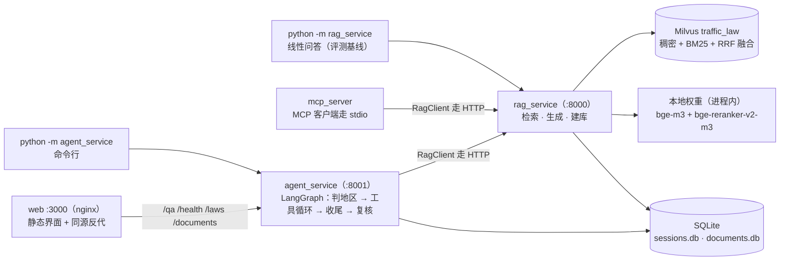

# 交通法规问答 Agent

用大白话问交通法规问题，答案里每句结论都挂着法条出处 —— `[依据N]` 能翻回原文；法条里没有的，它说「没有与问题相关的条文」并指出缺哪类规定，而不是编一条出来。

三条链路共用同一份检索与生成：

- **离线建库**：8 部法规的 docx 与 pdf 是建库真源，走 `解析 → 法→章→节→条 → 父子块 → 向量索引`。
- **在线问答**：一句大白话进来，走 `口语对齐 → 稠密 + BM25 混合检索 → 交叉编码器重排 → 强制引用式生成`。
- **Agentic RAG**：模型自己决定查什么、查几轮，末端逐条复核引用是否被原文支撑。

**不是把法条塞进提示词的问答壳子。** 正文里的 `[依据N]` 是模型写的，但「编号 → 原文」的对应由 `Answer.render()` 按检索结果生成，不经过模型的手；标了支撑不住的依据，末端复核节点会把整篇降级。这些口径不靠自觉：离线用例盯着行为，`tests/test_architecture.py` 用 AST 加子进程盯着结构。

## 做了什么

| 能力 | 状态 | 说明 |
|---|---|---|
| 建库管线 | ✅ | docx → 段落 → 法→章→节→条 → 父子块 → Milvus 集合；sha1 门控，源文件没变就跳过解析 |
| 混合检索 | ✅ | 稠密（`bge-m3`，1024 维，进程内跑）+ BM25 双路召回，分词与 RRF 融合都在 Milvus 服务端 |
| 交叉编码器重排 | ✅ | `bge-reranker-v2-m3`（sigmoid）；不可用或抛异常时按融合序返回并留一条 note |
| 强制引用式生成 | ✅ | 每条结论挂 `[依据N]`；参考文献段由 `Answer.render()` 拼，编号与原文的对应不过模型的手 |
| Agentic RAG | ✅ | LangGraph 单节点循环：模型自决查什么、查几轮；一轮没调工具就想收工会被代码闸拦下 |
| 会话记忆（短期） | ✅ | 请求带 `session_id` = 同一张会话跨轮记得住（LangGraph checkpointer，SQLite 落 `data/sessions.db`）；提示词里带最近 N 轮，不带则每问独立 |
| 地区澄清（人在环） | ✅ | 问题沾到具体地区时先中断问一句「按该地法规还是只按全国法」再作答，回复经 resume 端点交回（服务里默认开，`AGENT_CLARIFY` 控制） |
| 流式输出 | ✅ | rag `/qa/stream` 推检索结果与逐字 token；agent `/qa/stream` 推步骤流 + 逐字草稿；**草稿是草稿** —— `done` 才是复核之后的权威 |
| 末端复核 | ✅ | 逐条判「被原文支撑？」→ 低分整篇降级（阈值 0.35；标定账见文末台账） |
| 就绪门 | ✅ | 启动时比对 docx／本地产物／集合三者，不一致自动重建；也能 `--rebuild` 或 `POST /reindex` 手动触发 |
| 权重门禁 | ✅ | 索引快照里记着嵌入权重的指纹（文件名 + 大小 + mtime）：换了权重就拒绝服务并说明差在哪，`POST /reindex` / `RAG_ALLOW_REBUILD=1` 显式放行；老快照没指纹不拦，只标 `degraded`。启发式，防误换不防篡改 |
| 上传入库 | ✅ | `session` 只进本次会话（工具面可查，答完即弃）｜`permanent` 干跑校验后写进真源、落台账、重建生效 |
| HTTP 服务 | ✅ | `/qa` · `/qa/stream`（SSE）· `/answer`（只生成）· `/answer/stream` · `/health` · `/documents` 台账 · `/reindex` 热替换 runtime · `/laws` · `/articles/lookup` · `/materials/search` |
| 服务契约 | ✅ | `api_contracts/openapi.json`（提交即冻结）+ 漂移测试 + 薄 httpx 客户端；4xx/5xx 一律归成 `QaError` |
| MCP 适配层 | ✅ | `python -m mcp_server`（stdio）把 5 个工具喂给 MCP 客户端，只把请求转给上面的端点，返回原样透传；工具表不载模型、不 import SDK |
| 端口化 + 唯一装配点 | ✅ | `rag_contracts/ports.py` 7 个 ABC，换向量库/换供应商只改继承；装配只在各自的 `container.py`，别处不许自己 new 具体实现 |
| agent 出包 | ✅ | Agent 循环、工具面、网搜、轨迹渲染整个搬进 `agent_service/`，只依赖 `rag_contracts` 与 `api_contracts`，调 rag 一律经 `RagClient` 走 HTTP —— 结构上不再能伸手进 rag 进程（AST 门 + 子进程拦截门盯着） |
| 共享内核出包 | ✅ | `rag_contracts/`（域类型 + 端口 + 配置 + LLM 客户端 + 埋点）：两端共用，依赖方向单向，import 它不拉起重依赖 |
| 架构门禁 | ✅ | 用 AST 加子进程逐条检查：import 方向、装配只准在哪发生、重依赖不许被 `import rag_service` 顺手拉起、退役包名不许复活、同一句文案只许写一遍、提示词教的工具与真给模型的工具必须一致；契约包侧另查反向 import、轻依赖、打包面覆盖 |
| 可观测 | ✅ | 终端决策链渲染（`--trace` / `--timing`），可选 Langfuse 上报；分数/排名/通道留在 `search_log`，进不进提示词由渲染层定 |
| 联网检索 | ⚠️ 未接线 | `agent_service/websearch.py`（博查 API）已实现、有离线单测，但当前没挂进工具面 —— 要恢复就把 `agent_service/tools/registry.py` 里 web_search 那行的 `llm_visible` 改成 `True` |
| 降级可跑 | ✅ | 没有 LLM key：生成层拒答、检索照常；`法规知识库/models/` 里没有权重：退化成一套可用的纯 BM25 |

## 效果

| 题集 | 规模 | 结果 |
|---|---|---|
| 域内检索 | 82 题 | hit@1 74.4% · hit@3 86.6% · hit@6 90.2% · MRR@6 0.810 ｜ 池子召回 95.1% · 单通道召回 BM25 90.2% / 稠密 93.9% |
| 跨法多跳 · 纯检索 | 63 题 / 126 条 gold | gold 进 top-6 68/126，两条 gold 全中 13/63 |
| 题面自带条号（离线，0 次检索调用） | 112 题 | 唯一定位 107/112，其中取对 107/107 |
| 单跳 · rag vs agent | 82 题 · `qwen3-next-80b` | 首轮 hit@k 逐位相同；同预算 78/93 vs 78/93；全预算 78/93 → 79/93（agent 平均 1.2 次检索/题；6 部口径，未随 8 部重跑） |
| 跨法多跳 · 跑满 | 63 题 · `kimi-k2.6` | 同预算 rag 65/126 vs agent 首次 61/126；全预算 rag 65/126 → agent 查到 77/126、引用 70/126（agent 平均 2.6 次检索/题；6 部口径，未随 8 部重跑） |

口径须知：

- 前三行是纯检索，不花钱：本地 `bge-m3`（1024 维，CLS pooling + L2 归一化，无查询前缀）+ `bge-reranker-v2-m3`（sigmoid），全程不出网。
- 「命中」＝ gold 落在最终 top-6 里；多跳一题 2 条 gold，所以分母是 126 条。MRR 锁在 **@6**，池子放大也不会混进第 7 名往后的名次。
- 域内那行的三段是**同一趟**读出来的：检索按池子大小（candidates=20）取回整个候选池、重排后再截到 6，所以一份返回列表同时给出 单通道召回 ≤ 池子召回 ≤ hit@6 —— 通道层 / 融合层 / 排序层。单通道召回是「gold 在池子里、且这一路给了它名次」，池子本身经过融合，所以它不是通道各自 top-N 的原始召回；`--no-vector` 那趟稠密那格显示「未开」，不计入分母。
- 重排的净效果（同一个候选池 candidates=20）：单跳 hit@1 69.5% → 74.4%，多跳 59/126 → 68/126；池子放宽到 50：单跳 top-6 无变化，多跳多捞 5 条 gold（73/126），耗时 ×2.4，不划算。多跳的丢失分两段：池 50 时 gold 进池的上限是 97/126 —— 29 条从没进池、24 条进了池没排进 top-6。换栈那一轮（6 部）还量出嵌入与重排是成套件：只换嵌入不加重排，多跳反降到 58/126、比旧栈的 65/126 还低，加成重排才反超到 70/126。
- 后两行是 rag 与 agent 的对照，含生成模型（要花钱），数字来自真跑出来的轨迹（单跳 `data/traces/single82_q3next.json`、2026-09-22；多跳 `hop63_kimi.json`、2026-09-24）。**两行都早于换本地向量/重排，且是 6 部（508 条）语料时跑出的**（本轮语料升 8 部后未重跑，其余各行均为 8 部口径），绝对数别与上面纯检索行混读（旧栈单跳 hit@1 69.5%、多跳 65/126；新栈 74.4%、68/126）—— 它俩的用途是同一栈内两臂相比。「同预算」＝只算第一次检索的 top-6，「全预算」＝agent 全部轮次的候选合并（候选条数不同，只报查到 / 引用的 gold 条数）。多跳那行已与当前 63 题逐条核对（题面与 gold 全同），数字由轨迹离线复算，未再花钱。
- 检索延迟（容器内热态 p50，同一批问题）：纯 BM25 **4ms** ｜ 混合融合 **17ms** ｜ 混合 + 重排 **279ms**。

### 失败定位与成本（轨迹离线复算）

上面后两行的轨迹再逐题过一遍失败分类与成本（零外呼；同为 6 部口径）：查到 / 引用 / 全中题与 `eval/` 的汇总口径逐条对上。

| 轨迹 · 臂 | 查到 | 引用 | 全中题 | 失败构成 | 均 token/题 | 折算成本/题 |
|---|---|---|---|---|---|---|
| 单跳 82 · rag | 78/93 | 78/93 | 72/82 | 全中 72 ｜ 检索落空 7 ｜ 检索缺腿 3 | 1,170 | ¥0.0024 |
| 单跳 82 · agent | 79/93 | 77/93 | 71/82 | 全中 71 ｜ 检索落空 6 ｜ 检索缺腿 3 ｜ 有证据未引用 2 | 6,372 | ¥0.0080 |
| 多跳 63 · rag | 65/126 | 65/126 | 12/63 | 全中 12 ｜ 检索缺腿 41 ｜ 检索落空 10 | 1,188 | ¥0.0133 |
| 多跳 63 · agent | 77/126 | 70/126 | 15/63 | 全中 15 ｜ 检索缺腿 38 ｜ 检索落空 4 ｜ 有证据未引用 4 ｜ 证据在手只引一半 2 | 5,931 | ¥0.0417 |

- 失败类型按「引用」判、每题一个：全中 ｜ 检索缺腿（gold 没捞全）｜ 检索落空（一条没捞到）｜ 有证据未引用（捞到了但一条没引）｜ 证据在手只引一半（gold 都捞到了但只引了部分）。成本＝token × 刊例价**折算**（不是账单）：单跳按 `qwen3-next-80b-a3b-instruct`（输入 ¥1.101 / 输出 ¥8.807 每百万）、多跳按 `kimi-k2.6`（¥6.5 / ¥27）；复核模型的调用不在用量里。延迟只有 rag 单次端到端：单跳均 1.2s、多跳均 5.8s（最慢 10.1s）；agent 全链路轨迹里没记，只有检索段合计（180 / 344ms/题）。
- **单跳上 agent 不加值**：同预算与 rag 逐条相同（78/93），跑满轮次只多查到 1 条 gold、引用反少 1、全中题反少 1，代价 5.45× token。
- **多跳上 agent 加值，但增量全在第 2 轮起**：检索落空 10 → 4、全中题 12 → 15、引用 65 → 70；首轮还低于 rag（61/126 vs 65/126）—— 靠换查询词重查补回来，代价 4.99× token。
- 失败几乎全在检索侧：多跳的主失败是「检索缺腿」（41、38/63，缺的 gold 从没进过候选）；单跳是「检索落空」（7、6/82）；引用侧只有「有证据未引用」2~4 题 —— 有证据时模型基本都会引。
- 多跳那次开了复核闸：16/63 篇判降级（被点名不支撑的依据条数合计 57）；该轮阈值还是占位值 0.6，判官批（2026-10-10）事后判了这 16 条：11 条其实答对、5 条真错——复核分度量「引用标签卫生」不度量「结论正确性」（见文末台账），阈值已据此改为 0.35。

## 架构

两个进程、一条 HTTP 缝，外加一个纯静态的界面服务：



### 分层

| 包 | 职责 |
|---|---|
| `rag_contracts/` | ★ 两端共用的内核：`domain/` 报文与类型 · `ports.py` 7 个 ABC · `config.py` 路径常量与各组配置 · `llm.py` `OpenAILLM` 与工厂 `build_llm` · `observability/` 埋点与 Langfuse。**叶子包**：只被 import，不 import 任何消费者，也不在 import 期拉起重依赖 |
| `api_contracts/` | 两个进程之间那层：`openapi.json`（冻结面）+ 漂移测试 · `client.py`（`RagClient`，agent 侧唯一的 rag 入口）· `regen.py` |
| `rag_service/` | 知识库这一侧（服务本体，下面单列）：`cli/` 三条命令 · `api/` 门面与 HTTP 面 · `query/` 在线问答 · `indexing/` 建库 · `adapters/` 向量库、本地模型、台账 · `container.py` ★ rag 侧唯一装配点 |
| `agent_service/` | Agent 这一侧（另一个进程，下面单列）：`agents/` 图与节点 · `tools/` 工具面 · `merge.py` / `websearch.py` / `trace.py` / `prompts.py` · `api/` 自己的 HTTP 面 · `container.py` ★ agent 侧唯一装配点（只造 `RagClient`） |
| `eval/` | 评测与变异自检：`harness.py` / `singlehop.py` / `multihop.py` / `corpus.py` ＋ `mutations/` 四张表 |
| `mcp_server/` | MCP 适配层：stdio → HTTP，薄客户端，不载模型 |
| `deploy/` | `docker-compose.yml`（etcd / MinIO / Milvus / rag 服务 / agent 服务 / web 界面）· `docker-compose.dev.yml`（开发覆盖）· `build.sh` · `watchdog.sh` · `backup.sh` · `reinstall.sh` · `运维手册.md` |

两个进程之间只有 HTTP：`agent_service ──RagClient──▶ rag_service`。agent 侧不 import `rag_service`（AST 门 + 子进程拦截门都盯着），rag 侧也不 import `agent_service` —— 反向那条同样是门禁。

### 端口与装配点

可换的东西都有名字 —— `rag_contracts/ports.py` 里 7 个 ABC：

| 端口 | 谁实现 |
|---|---|
| `Embedder` | `adapters/embedding.py` |
| `Reranker` | `adapters/reranking.py` |
| `LLM` | `rag_contracts/llm.py`（`OpenAILLM` 与它的工厂 `build_llm` 同居一处；生成与 agent 共用一份客户端、一份重试） |
| `VectorStore` | `adapters/milvus.py` |
| `RagService` | `query/rag.py` |
| `IndexStatus` | `indexing/status.py` |
| `IndexBuilder` | `indexing/build.py` |

换向量库、换模型供应商、换检索策略，都只改继承；**装配只在各自的 `container.py` 发生**（rag 侧的 `build_store` / `build_retriever` / `build_rag` / `readiness` …，agent 侧的 `build_client` / `build_agent_runner`），别处不许自己 `new` 具体实现，只能接收注入的对象 —— 测试里塞内存假件就是靠这条；agent 侧连装配点都只允许造 `RagClient`，不许造 `LegalRAG`。

这些不靠自觉，`tests/test_architecture.py` 与 `tests/test_contracts_architecture.py` 用 AST 加子进程逐条检查：import 方向、装配只准在 `container.py` 发生、重依赖不许被 `import rag_service` 顺手拉起、退役的包名不许复活、同一句文案只许写一遍、提示词教的工具与真给模型的工具必须一致；契约包那侧另有一组：只许被 import 不许反向 import 消费者、import 它不拉起 torch 一类的重依赖、每个顶层包都得写进 `packages.find.include`。子包的 `__init__.py` 一律空着，不做 re-export。

### 目录

```
交通法规问答agent/
├── rag_contracts/         两端共用的内核：域类型 + 端口 + 配置 + LLM 客户端 + 埋点（叶子包）
├── api_contracts/         openapi.json + 漂移测试 + 薄 httpx 客户端（RagClient）
├── rag_service/           知识库这一侧（下面单列）
├── agent_service/         Agent 这一侧（下面单列，另一个进程，调 rag 只走 HTTP）
├── eval/                  评测与变异自检（顶层包，`python -m eval`）
├── mcp_server/            MCP 适配层：stdio → HTTP，薄客户端，不载模型
├── deploy/                docker-compose.yml + dev 覆盖 + build/watchdog/backup 脚本 + 运维手册
├── frontend/              浏览器界面（React + Vite）：src 源码 + nginx.conf + Dockerfile → web 镜像
├── docs/                  项目文档：00 导读 · 01 需求 · 02 设计 · 03 功能 · 04 接口文档（索引见 docs/README.md）
├── tests/                 离线用例，不碰 Milvus 也不调模型
├── 法规知识库/            docx + pdf（公开法规原文，建库真源）→ text → parsed → chunks → index；models/ 放本地权重
├── data/                  题集源语料 + 四份桶文件 + 上传台账（documents.db）（跑批轨迹不进版本库）
├── pyproject.toml         依赖与打包的唯一真源
└── CLAUDE.md              仓内协作规则（agent 面）

rag_contracts/
├── domain/        报文 · 回答 · 磁盘产物 · 报告 · 错误 · 法名
├── observability/ 轨迹埋点（`tracer.py`）与 Langfuse 上报（函数内 import，没装 extra 就退化）
├── ports.py       7 个 ABC（换实现只改继承）
├── config.py      路径常量与各组配置
└── llm.py         OpenAILLM + build_llm

rag_service/
├── cli/           三条命令：ask · build · serve
├── api/           对外一问一答 + HTTP 路由 + Runtime
├── query/         LegalRAG · mode 分派 · 改写 → 混合检索 · 精确取条 · 材料 · 强制引用式生成
├── indexing/      离线建库：docx 进，Milvus 集合出；含就绪门与上传入库
├── adapters/      向量库 · 本地模型 · 台账
├── prompts.py     生成侧提示词（4 份）
├── container.py   ★ rag 侧唯一装配点
└── Dockerfile     服务镜像

agent_service/
├── agents/        AgentRunner 与图：判地区 · 单节点循环 · 收尾 · 末端复核
├── tools/         工具面：schema · 参数规整 · 回执渲染 · 四个工具的实现
├── api/           自己的 HTTP 面：/qa · /qa/stream · /qa/resume（含流式）· /documents 代理 · /health
├── merge.py       多轮检索结果按 parent_id 合并去重
├── websearch.py   博查联网检索（已实现、当前未挂进工具面）
├── trace.py       终端决策链与分段耗时渲染（--trace / --timing）
├── prompts.py     agent 侧提示词（主循环 / 判地区 / 复核 / 复核补丁 / 复核降级答复 / resume 不可用答复）
├── cli.py         python -m agent_service
├── container.py   ★ agent 侧唯一装配点（只造 RagClient）
└── Dockerfile     agent 服务镜像
```

## 核心数据流

### 一、离线建库

```
法规知识库/docx/ + pdf/（8 部法规，建库真源）
  → indexing/sources.py    按后缀挑读者（docx / txt / md / pdf）
  → indexing/parser.py     段落 → 法→章→节→条（656 条），sha1 门控：源文件没变就跳过解析
  → indexing/chunker.py    条 = 父块，段 = 子块（966 个可检索块）
  → indexing/indexer.py    稠密（bge-m3，1024 维）+ 稀疏（BM25，jieba 分词）
  → Milvus 集合 traffic_law（分词与 RRF 融合都在服务端）
  → 磁盘产物：法规知识库/{text,parsed,chunks,index}
```

**就绪门**（`indexing/readiness.py`）在服务启动时跑：拿 `indexing/status.py` 比对 docx、本地产物与集合三者 —— 块数、条数、以及索引快照里记的向量模型名（`index_meta.json` 的 `embedding_model`）。不一致就调 `IndexBuilder.build()` 自动重建；换嵌入模型 = 必然全库重建 + 既有 hit@k 基线全部作废。也能 `python -m rag_service.cli.build build --force` 或 `POST /reindex` 手动触发。

### 二、线性问答（`qa()` / `POST /qa` mode=ask）

```
问题
  → query/dispatch.run(mode=ask)
  → query/rewriter         口语对齐（醉驾 → 醉酒、醉酒驾驶、醉酒后驾驶）
  → query/retriever        稠密 + BM25 双路召回 → bge-reranker-v2-m3 重排
  → query/generator        强制引用式生成：每条结论挂 [依据N]
  → Answer.render()        正文 + 参考文献（编号与原文的对应不过模型的手）
```

`mode=search` 走到重排为止就返回，不调用大模型（不花钱），评测的检索基线跑的就是这条路。重排不可用或抛异常时按融合序返回，并在 note 里留一句。

### 三、Agentic（`agent_service`，另一个进程）

```
问题（POST http://127.0.0.1:8001/qa，可带 session_id 记上下文）
  → agents/region          判地区（本地 / 深圳 / 全国）→ 定法名范围
  → agents/clarify         沾到具体地区先问一句再答（开了 AGENT_CLARIFY 时）
  → 单节点循环             模型自己决定调哪个工具、调几轮
      ├─ search_law            混合检索（可多轮，结果按 parent_id 合并去重）
      ├─ get_article           已知条号直取原文
      └─ search_materials      本次会话上传的材料
      · 零证据不许停：一轮没调任何工具就想收工 → 代码闸再叫一次
      · 同参重发不执行：与前面某一轮参数完全相同的调用回一句「已跳过」
  → 收尾                   模型写正文 + 逐条 [依据N]
  → agents/review          逐条判「被原文支撑？」→ 低分整篇降级
  → trace.py               决策链渲染（--trace / --timing / Langfuse）
```

上面每一步要的检索、取条、材料，都经 `RagClient` 打到 rag 服务的 HTTP 面（`/qa?mode=search` · `/articles/lookup` · `/materials/search` · `/laws` · `/answer` · `/answer/stream`）—— 进程里没有第二个 `LegalRAG`，也没有 `rag_service` 的任何 import。检索调用带超时预算（`AGENT_TOOL_TIMEOUT`，默认 15 秒）：超时回执单列「检索超时」（与一般失败分开），交模型换招、不自动重试。请求带 `session_id` 时同一会话跨轮记忆（LangGraph checkpointer，落 `data/sessions.db`）；开了 `AGENT_CLARIFY` 时，沾到地方的问题先中断问一句、由 resume 端点收尾（见「端点」）。

三道关卡都在代码里，不靠提示词自觉：**就绪门**（rag 服务启动/请求前保证索引可用）、**零证据闸**（`agents/nodes.py::_unearned_stop`）、**末端复核**（逐条判支撑，支撑不住的整篇降级）。

rag 那条路只剩两档；agent 循环搬走之后，它有自己的端点（见「端点」一节）：

| 入口 | 走多远 | 花不花钱 |
|---|---|---|
| rag `mode=search` | 检索 + 重排 | 不花 |
| rag `mode=ask` | 检索 + 生成 | 花（一次 LLM 调用） |
| agent `/qa` | 多轮工具调用 + 生成 + 复核 | 花（多次调用，最慢） |

## 快速开始

### 环境要求

- Python 3.10+
- Docker Desktop —— 跑 Milvus 用（只想裸跑也得起它一个：`docker compose -f deploy/docker-compose.yml -f deploy/docker-compose.dev.yml up -d --wait standalone`）
- GPU 可选：有 CUDA 就用 GPU 跑嵌入与重排；没有也能跑，只是慢

### 安装

```powershell
pip install -e ".[all]"
```

基础依赖只有三个包（`openai` · `python-dotenv` · `httpx`）；`pymilvus` 在 `milvus` 组，不装只是连不上 Milvus；`torch` + `transformers` 在 `local` 可选组里，不装也能跑 —— 退化成纯 BM25；`langgraph` 在 `agent` 组，不装只是起不了 agent 服务；`fastapi` + `uvicorn` 在 `api` 组，不装只是不能起服务；MCP SDK 在 `mcp` 组，不装只是不能 `python -m mcp_server`。`.[all]` 把这些组全带上（Langfuse 不在内，要上报单装 `.[langfuse]`；Studio 演示台在 `studio` 组，也不进 `all`）。

两个 Python 镜像各取所需，都不装对方的：rag 服务镜像装 `api,local,milvus,pdf`；agent 镜像装 `agent,api,langfuse`（不装 `pymilvus`、也不装 `torch` —— 它两条都不需要）。web 镜像只放 nginx 与前端构建产物。

### 配置

```powershell
Copy-Item .env.example .env     # 填 LLM_API_KEY
```

- `LLM_API_KEY`（连同 `LLM_BASE_URL` / `LLM_MODEL`）：生成要用的 OpenAI 兼容端点。没有 key 也能跑 —— 生成层拒答，检索照常。
- 嵌入与重排是本地权重，没有远端端点要配：放 `法规知识库/models/`（`bge-m3`、`bge-reranker-v2-m3`，ModelScope 可下，约 4.6GB，拉一次之后检索不出网）。只做 BM25 就不需要这两个。
- 可选：`AGENT_REGION_*` / `AGENT_REVIEW_*` 给判地区与末端复核单独配模型；`LANGFUSE_*` 开上报；`BOCHA_API_KEY` 给联网检索（已实现、当前未挂进工具面）。
- 检索侧还有一组 `RAG_*`（`RAG_TOP_K` 召回条数、`RAG_CANDIDATES` 候选池、`RAG_RERANK` 开关…），默认值都在 `.env.example` 里列着。
- 换了嵌入权重会让索引对不上号，所以建库时把权重目录的指纹（文件名 + 大小 + mtime）记进索引快照，启动时核对：对不上就拒绝服务（`/health` 503 并说明差在哪），指向同一目录的 `POST /reindex` 或 `RAG_ALLOW_REBUILD=1` 可显式放行 —— 放行即重建一次，新快照写入新指纹。指纹是启发式，防误换不防篡改。老快照（没记指纹）不拦，只把 `/health` 标成 `weights=unknown` / `degraded=true`，重建一次就补上。
- 指纹误报最常见的一种：模型目录是拷贝或解压来的，mtime 是拷贝那一刻而不是原始时间 —— 换机、重新拷贝都会翻新。真遇上了不用改代码，`RAG_ALLOW_REBUILD=1` 重建一次即可。

### 启动

```powershell
# 一路起全（Docker）：Milvus + 知识库服务 + agent + 浏览器界面（compose 文件在 deploy/ 下）
deploy/build.sh                                  # 建三个镜像并上线（直连 buildx；禁用 compose up --build；web 镜像要先有 frontend/dist）
docker compose -f deploy/docker-compose.yml up -d
docker compose -f deploy/docker-compose.yml ps   # 等六个容器 healthy
curl.exe localhost:8001/health  # 必须带 .exe：PowerShell 的 curl 是 IWR 别名
# 界面在 localhost:3000（nginx 静态托管 + 同源反代到 agent），8001 是 API 直连
```

生产面（base compose）宿主见两个入口：**8001**（agent，API 直连）与 **3000**（web，浏览器界面）；MinIO 凭据由 `deploy/.env` 两键必填提供。本地开发用覆盖文件恢复全部端口与默认凭据：

```powershell
docker compose -f deploy/docker-compose.yml -f deploy/docker-compose.dev.yml up -d
```

镜像里三个服务都在 compose 里：`app`（rag 服务，生产面不占宿主端口、dev 覆盖暴露 :8000；挂 GPU、四个命名卷、模型只读挂载）、`agent`（agent 服务，宿主 :8001 → 容器内 :8000；不挂 GPU，挂一卷 `tlr_sessions` 存会话记忆、不载模型，rag 地址由 `RAG_BASE_URL=http://app:8000` 给，地区澄清默认开）与 `web`（界面，宿主 :3000 → 容器 :80；nginx:alpine，只放前端构建产物，把 `/health` `/qa` `/laws` `/documents` 同源反代到 agent，上传限 10MB）。agent 的 healthcheck 读的是 `/health` 的 body：自己 `status=ok` 且内嵌的 `rag.status=ok` 才算健康，所以 rag 断掉它就会变 unhealthy。

改了代码要重建：跑 `deploy/build.sh`（等价直连 buildx 三条 + 把 app/agent/web 滚动上线）。镜像把源码烤进去了，不重建跑的还是上一版，且不报任何错；**也别用 `docker compose up --build`**（本机 compose v5.4.0 内嵌 bake 出错，报错表面像网络问题）或 `docker builder prune`。web 镜像 COPY 的是 `frontend/dist`，所以重建前先 `cd frontend && npm ci && npm run build`（缺 dist 时 `build.sh` 会直接提示这一句）。首次构建要下 CUDA 版 torch（约 2.8GB），之后有缓存就快。构建中途别 Ctrl-C：torch 下到一半断了不落缓存，下次还得重下。三个镜像构建完的体量：rag 6.03GB（大头就是 CUDA 版 torch），agent 266MB，web 63.2MB。

agent 一直 `unhealthy` 怎么办 —— 两种成因，修法同一条。① 启动时就探不到 rag（`boot_error`）：agent 进程本身是活的，`restart: unless-stopped` 不会触发（Docker 没有「unhealthy 就重启」这回事），而 lifespan 只跑一次，所以它不会自愈；② 起来之后 rag 又断了：healthcheck 变红，进程同样不重启。**先修好 rag，再 `docker compose -f deploy/docker-compose.yml restart agent`** —— 重启才会重跑一次 lifespan、重新探一遍 rag。

```powershell
# 裸跑（改代码即时生效）
docker compose -f deploy/docker-compose.yml -f deploy/docker-compose.dev.yml up -d --wait standalone   # 只起 Milvus（dev 覆盖才有宿主 19530）
python -m rag_service.cli.build build        # 建库，docx 没变就跳过解析
python -m rag_service "醉驾怎么处罚"          # 提问（线性管道）
python -m rag_service.cli.serve              # 起 rag 服务（另开一个终端）
python -m agent_service "在深圳，不按规定使用安全带罚多少？" --timing   # agent 循环，走上面那个服务
```

Agent 是另一个进程：它默认打 `http://127.0.0.1:8000`（`--http` 或 `RAG_BASE_URL` 换地方），检索、取条、材料、生成全在 rag 服务里发生；`python -m uvicorn agent_service.api.app:app --port 8001` 把它立成服务，端点面见下。注意 compose 里已经常驻着一个（宿主 :8001），下面这条裸跑是改代码时用的，两个都打同一个 rag。

```python
# 当库用
from rag_service import qa

print(qa("醉驾怎么处罚").render())                                 # 检索 + 生成
print(qa("深圳 行人在机动车道 罚款多少", mode="search").render())  # 只检索，不花钱
```

### 测试

```powershell
python -m pytest                # 359 条离线用例，约 26 秒；不碰 Milvus、不调模型
ruff check .
```

`pyproject.toml` 的 `addopts` 里已经有 `-q`，再加一个 `-q` 会变成 `-qq`，把最后的汇总行吞掉 —— 直接跑 `pytest` 就好。全部离线可跑，一条都不跳过；`integration` 这个 marker 留给「要 Milvus 或模型端点」的用例（`pytest -m integration` 才跑），目前还没有用例标它。

命令与端点一览见下面两节。

## 入口

| 命令 | 干什么 |
|---|---|
| `python -m rag_service "问题"` | 提问：线性管道（评测基线） |
| `python -m rag_service.cli.build <子命令>` | 建库：`build` / `status` / `layers` / `docx` / `parse` / `chunk` / `index` |
| `python -m rag_service.cli.serve [--host H] [--port P]` | 起知识库服务 |
| `python -m agent_service "问题" [--trace] [--timing] [--json]` | 提问：完整 Agent 循环（判地区 → 规划 → 工具调用 → 复核 → 生成），打的是 rag 服务的 HTTP 面 |
| `python -m uvicorn agent_service.api.app:app --port 8001` | 把 agent 立成服务（`/qa` · `/qa/stream` · `/qa/resume` · `/qa/resume/stream` · `/documents` 材料台账 · `/health`）；compose 里已常驻一个（宿主 :8001），这条是裸跑用 |
| `python -m eval [--reference] [--pool N] [--http asgi\|URL]` | 评测：域内 池子召回 / hit@k / 单通道召回 ｜ 点名桶取条。`--http` 把同一套题发到服务端点（跨进程那条臂；不给默认走 asgi，等于在本进程里起一个真 app 过真 HTTP） |
| `python -m eval.singlehop` | 单跳两臂对照 |
| `python -m eval.multihop` | 跨法多跳 |
| `python -m eval.corpus build\|check` | 题集桶文件：重建 / 只读比对 |
| `python -m eval.mutations.run all` | 变异自检：把规则改坏，看门禁是否翻红（`retrieval` / `contract` / `gates` / `mcp` 四张表） |
| `python -m mcp_server` | MCP 适配层（stdio）：把工具面喂给 MCP 客户端，请求转给上面的 HTTP 端点。`--list-tools` 离线打印工具表，`--base-url` / `RAG_BASE_URL` 指定服务地址 |
| `langgraph dev` | Studio 演示台（要 `pip install -e ".[agent,studio]"`，rag 服务先起着）：起 `agent_service/studio.py` 那张图，看步骤流与澄清中断。Windows 上配 `PYTHONUTF8=1` + `--allow-blocking`，细节在接口文档 §7 |
| `python -m api_contracts.regen` | 重出 `api_contracts/openapi.json` |
| `tlq-qa` / `tlq-build` / `tlq-serve` / `tlq-eval` | 上面各条的短命令 |

一个命令一条路径，`--help` 一律只打印用法，不碰磁盘、不连 Milvus。

## 端点

### 知识库服务（rag_service，:8000）

| 端点 | 干什么 |
|---|---|
| `GET /health` | 启动耗时、法规/条数/块数、通道与重排态、索引是否复用、就绪标记、权重指纹三态（`weights` + `degraded`） |
| `POST /qa` | 一次问答：`ask`（检索+生成，默认）｜ `search`（只检索，不花钱）。输出撞上 `max_tokens` 被截断时，`notes` 里会明说 |
| `POST /qa/stream` | 同上，SSE 边生成边推：`evidence`（检索结果，一发）+ `delta`（真 token 流，若干）+ `done`（含 `truncated` / `usage` / `citations`） |
| `POST /answer` | 只生成、不检索：body 带 `question`（含 `history`）与已经检索好的 `retrieval`（`POST /qa?mode=search` 的返回），可选 `timeliness` / `materials`。语义是「我已经检索好了，你只负责生成」——`retrieval` 缺了就是 422，服务端不会自己再去检索一次 |
| `POST /answer/stream` | 同 `/answer` 的流式版（SSE）：`delta` 逐字 + `done`=完整 `Answer`。agent 的逐字流走这条 |
| `POST /documents` | 传 docx / md / txt / pdf：`session` 只进本次会话（工具面可查，答完即弃）｜ `permanent` 干跑校验后入知识库，落台账 |
| `GET /documents` | 上传台账；`DELETE /documents/{id}` 撤掉一份 |
| `POST /reindex` | 重建索引并热替换运行中的 runtime |
| `GET /laws` | 库内法规清单（`law_id` / 名称 / 版本 / 条数 / 是否地方性）—— 要用 `law_filter` 先来这儿拿 id |
| `POST /articles/lookup` | 按条号精确取一条原文：`article_no`（可选配 `law_name`），或直接给一句带条号的 `text`。查不到不报错：200 + `found=false` + `note` 说明为什么 |
| `POST /materials/search` | 在本次会话上传的材料里检索，返回 `passages` 与渲染好的 `text` |

`POST /qa` 另有三个诊断参数（`ask` / `search` 生效）：`pool` 覆盖候选池深度并按它放行超过 `top_k` 上限的返回条数（上限 `RAG_POOL_MAX`，与 eval 的 `--pool` 同口径）、`debug` 回传两路通道各自的名次与原始分、`law_filter` 只在给定 `law_id` 内检索。

上表的机器可读版本是 `api_contracts/openapi.json`（由 `app.openapi()` 生成，`python -m api_contracts.regen` 重出），`tests/test_openapi_contract.py` 逐字节盯着它与应用是否一致；配套的薄客户端 `api_contracts/client.py` 进出一律 dict、4xx/5xx 一律抛 `QaError`（材料台账的三个透传方法例外——状态码原样带回，见下节 agent 表），MCP 适配层、eval 的 HTTP 臂与 agent 服务共用它。

### agent 服务（agent_service，宿主 :8001 → 容器 :8000）

| 端点 | 干什么 |
|---|---|
| `GET /health` | 自己没就绪（缺 langgraph / 没 key）就 503 带原因；就绪时透传 rag 服务的 `/health`（`rag.status=unreachable` 时整条 `status` 变 `degraded`） |
| `POST /qa` | **完整 Agent 循环**：判地区 → 规划 → 工具调用（可多轮）→ 复核 → 生成。与 rag 的 `/qa?mode=ask\|search` 语义不同、**不是它的代理**：模型自己决定查几轮、查什么，末端还要逐条复核引用是否被原文支撑，支撑不住的整篇降级。body：`question` · `top_k` · `doc_ids`（本次会话材料的 doc_id）· `session_id`（跨轮记忆句柄）。开了澄清且问题沾到地方时返回 `status=interrupted`（拿 `session_id` 去 resume），答完是 `status=ok`——两种都是 200 |
| `POST /qa/stream` | 同上，SSE 推：步骤流 `step`（每个节点一步）+ 逐字 `delta`（**草稿**）+ `done`（复核之后的权威整篇）+ `interrupt`（等澄清回复，出了它就是这一轮的终点）；中途任何一步出错收成 `error` 帧 |
| `POST /qa/resume` · `/qa/resume/stream` | 把澄清回复交回去：body `{session_id, value: {region}}` —— `region` 给地区名就按该地法规 + 全国法答，给 `national` 只按全国法。前者普通 JSON（没有等待中的澄清 → 409），后者 SSE（同类冲突收成 `error` 帧）；细节在接口文档 §3.2 |
| `POST /documents` · `GET /documents` · `DELETE /documents/{id}` | 材料台账的**代理面**，字段与返回同 rag 面同名端点（上传 multipart `file` + 可选 `mode`，列表可 `?mode=` 过滤，按 id 撤一份）。**生产面宿主只有这一条路能传材料**——上传会话材料拿 `doc_id` 走这里；拒收 400 与无此件 404 原样透传（不翻 503），不依赖 agent 图就绪、不进日额度闸；过鉴权与限流 |

带 `session_id` 的请求共用一张会话；会话记忆落 SQLite（`AGENT_SESSION_DB`，默认 `data/sessions.db`）。流式面上 `delta` 是草稿、`done` 才是权威 —— 末端复核可能整篇降级替换。

这个面不出 openapi：本轮没有第二个消费者，契约面只冻结 rag 那一侧（`api_contracts/openapi.json`），agent 侧的字段由 `tests/test_agent_wire.py` 过真 HTTP 盯着。

**观测（langfuse）在容器里的状态**：agent 服务这一侧是开着的 —— `AgentRunner.attach` 在没被注入 tracer 时会调 `from_env()`，`.env` 里配了 `LANGFUSE_*` 就真往云端上报（启动日志会有一行 `[langfuse] 观测已开启：…`），没配就静默关。rag 服务那一侧相反：**没有 tracer 装配点，镜像也没装 langfuse，永远不上报**（它的 langfuse 只在跑批/CLI 那边用）。它是**全局开关**：compose 里两个服务读同一份 `.env`，没有 per-service 开关 —— 要单独关某一个，只能给那个服务换一份不含 `LANGFUSE_*` 的 env_file；容器里也没有 `--no-langfuse`（那是 CLI 的参数），要关就不给 keys。

## 它长什么样

`qa("醉驾怎么处罚")` 的真实输出节选：

> 醉酒驾驶机动车的，由公安机关交通管理部门约束至酒醒，吊销机动车驾驶证，依法追究刑事责任；五年内不得重新取得机动车驾驶证。 [依据1]
>
> 参考文献：
>   【依据1】 《中华人民共和国道路交通安全法》(2021-04-29)第九十一条 — 第九十一条　饮酒后驾驶机动车的，处暂扣六个月机动车驾驶证，并处一千元以上二千元以下罚款。…

正文里的 `[依据N]` 是模型写的，`参考文献` 那段是 `Answer.render()` 按检索结果拼的 —— 编号与原文的对应不经过模型的手。

## 技术栈

| 层 | 选型 |
|---|---|
| 向量库 | Milvus 2.6：稠密 + BM25 双路召回，分词与融合都在服务端 |
| 模型 | 生成 `kimi-k2.6`（`.env.example` 默认 `qwen-flash`）· 向量 `BAAI/bge-m3` · 重排 `BAAI/bge-reranker-v2-m3`（后两个在进程内跑，权重在 `法规知识库/models/`，有 GPU 就用 GPU） |
| 服务 | FastAPI + uvicorn，`/qa/stream` 走 SSE |
| Agent | LangGraph 状态机，LLM 调用直接走 `openai` SDK |
| 依赖 | 基础组只有三个包：`openai` · `python-dotenv` · `httpx`；`pymilvus` 在 `milvus` 组，嵌入/重排的 `torch` + `transformers` 在 `local` 可选组，不装也能跑，退化成纯 BM25（agent 侧这两组都不装）；pdf 解析的 `pypdf` 在 `pdf` 组 —— 建库碰到 PDF 缺它就显式报错，不静默跳过 |

## 进阶

自用台账，与上面的项目介绍无关。
- agent后面加一个审查正确性agent,再加打分agent测正确率
    —— 前半已落：末端复核节点（判支撑 + 算分 + 低分降级）。后半也已落：阈值按判官批标定，2026-10-10 定为 0.35
       （63 条：拦 6 = 3 真错 + 3 误杀、交付正确率 77.8%；旧 0.6 拦 16 = 5 真错 + 11 误杀）。
       检测力已有量化：复核分度量「引用标签卫生」不度量「结论正确性」——高分区结构性漏放（6 条放行判错里 3 条 score=1.0）；
       旧探针（「追加原文没有的话两次都判支撑」）打的是入口意图模型，不是复核模型；复核模型 2026-10-10 随基线换成 kimi-k2.6，与阈值标定臂同源（容器端到端未重跑标定批）。
- 加网页搜索工具 —— 已实现，但没挂进工具面，见上。
- 加PDF解析 —— 已落地：pdf/ 与 docx/ 并列建库真源、上传通道也收 pdf（缺 pypdf 显式报错不降级），8 部 / 656 条 / 966 块；换语料后免费检索行已重跑（LLM 两行停在 6 部口径）。
- 记忆（这项目好像需求不高）
- 再进阶：数据库优化 / redis / 消息队列 / 更清晰的架构

## 文件结构

概览见上面「架构 → 目录」；这里是逐文件版。各子包的 `__init__.py` 都是空文件（不做 re-export），不再逐条列。

```
交通法规问答agent/
├── rag_contracts/          共享内核（源码包）
│   ├── domain/              报文 · 回答 · 磁盘产物 · 报告 · 错误 · 法名
│   ├── observability/       轨迹埋点 tracer.py · Langfuse 上报 langfuse.py
│   ├── ports.py             7 个 ABC（换实现只改继承）
│   ├── config.py            路径常量与各组配置
│   └── llm.py               OpenAILLM + 工厂 build_llm
├── rag_service/            知识库服务（源码包）
│   ├── __init__.py          对外门面：qa / render / QaError
│   ├── __main__.py          python -m rag_service → cli/ask.py
│   ├── container.py         ★ rag 侧唯一装配点
│   ├── prompts.py           生成侧提示词 4 份
│   ├── cli/  api/           入口 · HTTP 面
│   ├── query/               在线：改写 · 混合检索 · 取条 · 材料 · 生成
│   ├── indexing/            离线建库 · 索引校验 · 就绪门 · 上传入库
│   ├── adapters/            向量库 · 本地模型 · 台账
│   └── Dockerfile           服务镜像
├── agent_service/          Agent 服务（源码包，另一个进程）
│   ├── container.py         ★ agent 侧唯一装配点（RagClient、会话库、法条清单）
│   ├── prompts.py           agent 侧提示词
│   ├── agents/  tools/      图与节点（含澄清中断、会话记忆）· 工具面
│   ├── api/  cli.py         自己的 HTTP 面 · 命令行
│   ├── studio.py            Studio 演示台入口（langgraph.json 指向它）
│   └── merge.py  websearch.py  trace.py
├── eval/                    评测（harness / singlehop / multihop / corpus）＋ 变异自检 mutations/
├── mcp_server/              MCP 适配层：tools.py（工具表，不 import SDK）· main.py（stdio 装配）
├── api_contracts/           openapi.json · client.py（薄 httpx 客户端）· regen.py
├── deploy/                  docker-compose.yml · docker-compose.dev.yml · build.sh · watchdog.sh · backup.sh · reinstall.sh · 运维手册.md
├── frontend/                浏览器界面（React + Vite）：src · nginx.conf · Dockerfile（web 镜像）；dist/ 是构建产物
├── docs/                    项目文档（索引见 docs/README.md）
├── tests/                   离线用例（不碰 Milvus、不调模型）
├── 法规知识库/              docx + pdf（建库真源）· text · parsed · chunks · index · models
├── data/                    题集与桶文件 · documents.db · uploads/ · traces/
├── volumes/                 etcd / MinIO / Milvus 的运行时数据（compose 挂载，可重建）
├── pyproject.toml · requirements.txt · langgraph.json
├── .env.example · .gitignore · .gitattributes · .dockerignore
└── README.md · CLAUDE.md
```

### 仓库根

| 文件 | 作用 |
|---|---|
| `rag_service/Dockerfile` | 服务镜像：python:3.11-slim → CUDA 版 torch（独立一层，改源码重建不重下）→ `.[api,local,milvus,pdf]` → 把五个包（`rag_contracts/` `rag_service/` `eval/` `mcp_server/` `api_contracts/`）与 `法规知识库/`、`data/` 一起烤进镜像 → 非 root 用户 → `uvicorn rag_service.api.app:app` |
| `agent_service/Dockerfile` | agent 服务镜像：同一个底（python:3.11-slim、非 root uid 1000、`EXPOSE 8000`），装 `.[agent,api,langfuse]`，只 COPY 三个包（`rag_contracts/` `api_contracts/` `agent_service/`）—— 没有 torch、没有 Milvus 客户端、也没有 `法规知识库/` 与 `data/`：它不载模型；自己的会话记忆写在挂载卷上（镜像里先把 `/app/data` 的属主铺好） |
| `deploy/docker-compose.yml` | 六个服务：etcd / MinIO / Milvus standalone / app（rag）/ agent / web。app 挂 GPU、四个命名卷、健康检查打 `/health`；agent 只发布 8001、不挂 GPU，挂一卷 `tlr_sessions:/app/data`（会话记忆）并置 `AGENT_CLARIFY=1`，healthcheck 读 `/health` 的 body（要 `rag.status=ok`，不是只看 200）；web 只发布 3000（nginx:alpine，只放前端构建产物，`/health` `/qa` `/laws` `/documents` 同源反代到 agent）。顶层 `name: agent` 钉住项目名（否则项目名随目录走，挪文件会换一组空卷）；`build.context` / `env_file` / 卷路径都相对本文件解析，**但 `build.dockerfile` 相对 `context` 解析**（`context: ..` 时写 `rag_service/Dockerfile`，写成 `../rag_service/Dockerfile` 会跑去找仓库外那一层、且 `config` 不报错）—— 固定用 `docker compose -f deploy/docker-compose.yml` 起 |
| `deploy/reinstall.sh` | 重装 editable 包：探 Clash 代理 → `pip install -e ".[all]"`（依赖组可用第一个参数换，默认 `all`）→ 换到仓外验证六个包 import 装没装上 |
| `deploy/docker-compose.dev.yml` | 开发覆盖：恢复 8000/9000/9001/19530/9091 宿主端口与默认 MinIO 凭据（字面值优先于 base 的必填插值） |
| `deploy/build.sh` · `watchdog.sh` · `backup.sh` · `运维手册.md` | 重建镜像（直连 buildx，禁用 `up --build`）· 探活告警（单次/`--loop`，可 POST webhook）· 冷备与恢复（`--keep`/`--restore`）· 部署/巡检/告警/并发闸/成本/会话清理/备份恢复/密钥轮换/口径五条的作业面 |
| `pyproject.toml` | 依赖与打包的唯一真源：基础三依赖 + `agent` / `api` / `langfuse` / `local` / `mcp` / `milvus` / `pdf` / `dev` / `all` 可选组、四个短命令、pytest 与 ruff 配置；`packages.find` 覆盖 `rag_contracts*` / `rag_service*` / `agent_service*` / `eval*` / `mcp_server*` / `api_contracts*`（顶层包与模式双向比对由 `tests/test_contracts_architecture.py` 盯着） |
| `requirements.txt` | 只镜像基础三依赖，给「不装整包、只装依赖」的场景（`pymilvus` 已移到 `milvus` 组，不在这里）；依赖的真源仍是 `pyproject.toml` |
| `.env.example` | 配置模板：三段模型端点、`RAG_*` 检索参数、`AGENT_*`、Langfuse、博查 |
| `.gitignore` | 挡掉 `.env`、虚拟环境、缓存，以及 `data/`、`法规知识库/` 里的运行产物 |
| `.gitattributes` | 仓库内一律存 LF；docx / pdf / db 等声明为二进制，不做换行转换 |
| `.dockerignore` | 构建上下文排除 `.git`、`.venv`、`volumes/`、`法规知识库/{parsed,text,chunks,index,models}`、`data/traces/` —— 镜像只带真源（docx + pdf），顺带保证密钥不进镜像层 |
| `README.md` | 本文件 |
| `CLAUDE.md` | 仓内协作规则（面向 coding agent） |
| `frontend/` | 浏览器界面：`src/`（React + Vite 源码）· `nginx.conf`（同源反代）· `Dockerfile`（nginx:alpine）· `dist/`（构建产物，不进版本库）；界面走 agent 的 HTTP 面，没有独立后端 |
| `docs/` | 项目文档：00 导读 / 01 需求 / 02 设计 / 03 功能 / 04 接口文档 —— 04 是签名级契约：CLI / HTTP / 配置 / 产物 / 不变式（README「入口」是清单，这一份是契约）；索引见 docs/README.md |
| `法规知识库/` | `docx/` 与 `pdf/` 是建库真源（公开法规原文）；`text/` `parsed/` `chunks/` `index/` 是管线产物；`models/` 本地权重（约 4.6GB） |
| `data/` | 题集源语料 + 四份桶文件（`eval_*.json`）+ `documents.db` 上传台账 + `uploads/` + `traces/` 跑批轨迹 |
| `volumes/` | compose 挂载的运行时数据（etcd / MinIO / Milvus），可重建 |

### rag_service/

| 文件 | 作用 |
|---|---|
| `__init__.py` | 对外门面，只导出 `qa` / `render` / `QaError`；import 它不会拉起任何重依赖 |
| `__main__.py` | `python -m rag_service` 转发到 `cli/ask.py` |
| `container.py` | rag 侧唯一装配点：11 个 `build_*` + `readiness`；具体实现在函数内 import，避免拖起重依赖 |
| `prompts.py` | 生成侧提示词 4 份：系统 / 用户模板 / 时效头 / 材料头 |

### rag_contracts/

| 文件 | 作用 |
|---|---|
| `ports.py` | 7 个 ABC：`Embedder` `Reranker` `LLM` `VectorStore` `RagService` `IndexStatus` `IndexBuilder` |
| `config.py` | 路径常量（`*_DIR` / `*_PATH`）与七组配置：LLM、判地区、复核、嵌入、重排、检索、Agent、博查、Langfuse、Milvus，各配一个 `*_config()` 读 env；`COMPOSE` 是 compose 命令串的唯一出处 |
| `llm.py` | `OpenAILLM`（重试、流式、usage 归一）与工厂 `build_llm`；全仓唯一直接碰 openai SDK 的地方 |

### cli/ · api/

| 文件 | 作用 |
|---|---|
| `cli/ask.py` | 主命令：线性管道，`--search` / `--debug` / `--top-k` / `--json` / `--rebuild` / `--no-vector` 都在这里；USAGE 文本同文件（Agent 循环在另一个包：`python -m agent_service`） |
| `cli/build.py` | 建库命令 `python -m rag_service.cli.build`：`build` / `status` / `layers` / `docx` / `parse` / `chunk` / `index` |
| `cli/serve.py` | 起服务（`uvicorn.run`，`--host` / `--port`） |
| `api/app.py` | FastAPI app 本体：lifespan、两个异常处理器、`QaRequest` / `AnswerRequest`、`/health`、`/qa`、`/qa/stream`、`/answer` 与 SSE 编码 |
| `api/runtime.py` | `Runtime`（`ready` / `rag` / `boot_ms` / `dense_live`）+ `boot_runtime`（过门装配并预热） |
| `api/facade.py` | 对外门面 `qa()` / `render()` —— `from rag_service import qa` 落到这 |
| `api/routes.py` | 文档台账路由：`POST` / `GET /documents`、`DELETE /documents/{id}`、`POST /reindex`；判据与回执文案不在这，只转发 `indexing/ingest.py` |

### query/

| 文件 | 作用 |
|---|---|
| `query/rag.py` | `LegalRAG`：`RagService` 的实现 —— 检索、生成、流式、`describe()` |
| `query/dispatch.py` | mode 分派：`run(rag, question, mode=ask\|search)`，门面与 HTTP 都走它 |
| `query/retriever.py` | `HybridRetriever`：稠密 + BM25 召回 → RRF → 重排；`--debug` 的通道明细 |
| `query/rewriter.py` | 口语对齐与别名扩充（醉驾 → 醉酒 / 醉酒驾驶 / 醉酒后驾驶） |
| `query/articles.py` | 精确取条：法名识别、中文与阿拉伯条号解析、定位与越界提示 |
| `query/materials.py` | 会话材料：读台账元信息、按重合度检索、给材料编号 |
| `query/generator.py` | `AnswerGenerator`：强制引用式生成（`chat` 与 `stream` 两条）＋ 两条兜底答复（检索为空 / 无 LLM） |

### agent_service/

| 文件 | 作用 |
|---|---|
| `agents/graph.py` | `AgentRunner`（`attach` / `ask` / `invoke` / `stream` / `describe`）与图的路由函数；`rag` 属性是 `RagClient`；`stream` 用 `stream_mode=["updates","values"]` 发轮次事件，终态取最后一片 `values` |
| `agents/nodes.py` | 三个节点工厂（主循环 / 工具执行 / 收尾）+ 零证据闸 `_unearned_stop` |
| `agents/region.py` | 判地区（本地 / 深圳 / 全国）→ 定法名范围 |
| `agents/review.py` | 末端复核：抽 `[依据N]`、逐条判「被原文支撑？」、低分整篇降级 |
| `agents/state.py` | `AgentState`：图状态（消息、检索日志、外部结果、材料、用量…） |
| `tools/schemas.py` | 四个工具的 JSON schema 与名字常量；`top_k`、材料的上下界引 `rag_contracts/domain/retrieval.py` 的常量（HTTP 入参、参数规整、本 schema 三处同源）；`WEB_COUNT_*` 上下界在这定义 |
| `tools/arguments.py` | 模型给的参数 → 规整后的调用，以及回执封装 |
| `tools/render.py` | 工具回执渲染（摘录、去重、只留可动的 note）+ `LOG_SEARCH` / `LOG_WEB` / `LOG_MATERIAL` 前缀，写方与轨迹解析方共引 |
| `tools/handlers.py` | 工具实现：`search_law` / `get_article` / `web_search` / `search_materials`；`ToolEnv` 是它们的运行环境（`env.rag` 就是 `RagClient`） |
| `tools/registry.py` | 工具面唯一一张表：名字 / schema / handler / 可见性同源（`llm_visible=False` 的只实现、不示人）；下发给模型的 `TOOLS` 与分发用的 `HANDLERS` 都由它派生 |
| `merge.py` | 多轮检索结果按 `parent_id` 合并去重（从 rag 搬来的；不再要 rag 进程内的 `parents` 表） |
| `websearch.py` | 博查联网检索：已实现、有离线用例，当前未挂进工具面 |
| `trace.py` | 终端渲染：`--trace` 决策链与 `--timing` 分段耗时（渲染 `AgentState`） |
| `prompts.py` | agent 侧提示词：主循环 / 判地区 / 复核 / 复核补丁说明 / 复核降级答复 / resume 不可用答复 |
| `api/app.py` | agent 自己的 FastAPI app：`/health`（带 rag 可达性）+ `/qa` + `/qa/stream`；`app.state.runner` |
| `cli.py` | `python -m agent_service`：`--http` / `--top-k` / `--max-steps` / `--trace` / `--timing` / `--langfuse` / `--json` |
| `container.py` | ★ agent 侧唯一装配点：`build_client`（唯一造 `RagClient` 的地方）/ `build_agent_runner` / `boot_agent_runner`（先探 rag 就绪再装配） |

### indexing/ · adapters/

| 文件 | 作用 |
|---|---|
| `indexing/sources.py` | 读者按后缀挑：docx（直读 zip + ElementTree）· pdf（pypdf，缺包显式报错）· txt / md；`reader_for` 是唯一入口 |
| `indexing/parser.py` | 段落 → 法→章→节→条；`LawParser` / `LawLibrary` / `ParseStage`；中文数字、目录页、零宽字符清洗、sha1 门控 |
| `indexing/chunker.py` | 条 = 父块、段 = 子块（966 个可检索块） |
| `indexing/indexer.py` | 写 Milvus（稠密 + 稀疏）与磁盘产物 |
| `indexing/status.py` | `CorpusStatus`：比对 docx / 本地产物 / 集合三者，给出 `stale_reason` 与期望的嵌入模型名 |
| `indexing/build.py` | `RagPipeline`：把上面几步串成一次 build（`IndexBuilder` 的实现），也暴露 parse / chunk 单步 |
| `adapters/milvus.py` | `MilvusStore`：建集合、插入、三种检索、`law_filter`；字段常量、`row_of`、`wait_until_ready` |
| `adapters/embedding.py` | `LocalEmbedder`：bge-m3，1024 维，进程内跑 |
| `adapters/reranking.py` | `LocalReranker`：bge-reranker-v2-m3，sigmoid |
| `adapters/local_model.py` | 上面两个的公共底座：懒加载、`available` / `unavailable_reason` / 权重的指纹与门控 |
| `adapters/sqlite.py` | `data/documents.db` 的 DDL、`DocumentRow` 与 CRUD |

### rag_contracts/domain/ · observability/ · agent_service/trace.py

| 文件 | 作用 |
|---|---|
| `rag_contracts/observability/tracer.py` | `Tracer` 空实现基类 / `Recorder`（记 span 耗时）/ `traced` 装饰器 |
| `rag_contracts/observability/langfuse.py` | Langfuse 上报（没配就退化成空实现；不进线性路；SDK 在函数内 import） |
| `agent_service/trace.py` | 终端渲染：`--trace` 决策链与 `--timing` 分段耗时（渲染 `AgentState`） |
| `rag_contracts/domain/disk.py` | 磁盘产物类型（`Paragraph` … `ChunkSet`、`IndexStats`）与 jsonl 读写 |
| `rag_contracts/domain/retrieval.py` | 检索侧报文：`Query` / `RewrittenQuery` / `RetrievedArticle` / `RetrievalResult` / `WebFinding` / `MaterialPassage` |
| `rag_contracts/domain/answer.py` | `Question` / `Evidence` / `Review` / `Answer`（含 `render()` 的正文 + 参考文献拼装） |
| `rag_contracts/domain/reports.py` | 报告与就绪态：`StageReport` / `PipelineReport` / `CorpusStats` / `ReadyState` ＋ 通道摘要 `channel_label` / `channel_state` |
| `rag_contracts/domain/laws.py` | `LawInfo` 与 `laws_of` / `resolve_law`：法名归一与「这个法名指哪一部」 |
| `rag_contracts/domain/textutil.py` | 纯函数：`cn_to_int`（中文数字）· `sha1_of`（门控与查重）· `bigrams`（重合度） |
| `rag_contracts/domain/errors.py` | `QaError` |

### eval/

| 文件 | 作用 |
|---|---|
| `eval/__main__.py` | `python -m eval` 的入口 |
| `eval/harness.py` | 域内三段指标（82 题：池子召回 / hit@k / 单通道召回）与「题面自带条号」的规则取条（112 题）；`--http` 那条臂（默认 `asgi`：本进程里真起一个 app，走真 ASGI）经 `api_contracts.client` 发题，统计是同一份 |
| `eval/singlehop.py` | 单跳两臂对照与指标 |
| `eval/multihop.py` | 跨法多跳：建题、跑轨迹、复算与对账（改 gold 可离线重打分） |
| `eval/corpus.py` | 题集桶文件：`build` 重建 / `check` 只读比对，含法名归一与撞车检测 |
| `eval/mutations/` | 变异自检：四张表（`retrieval` 指标口径 / `contract` 契约与工具面 / `gates` 门禁自身 / `mcp` 适配层）+ 一个跑表器，改动源码后跑它 —— 「改坏了必须翻红」才是覆盖 |

### mcp_server/ · api_contracts/ · deploy/

| 文件 | 作用 |
|---|---|
| `mcp_server/tools.py` | 5 个工具（`rag_search` / `rag_ask` / `rag_get_article` / `rag_laws` / `rag_search_materials`）的名字、JSON schema 与处理器 —— 只经 `api_contracts.client` 转发，返回 dict 原样透传；**不 import `mcp`**，离线可测 |
| `mcp_server/main.py` | stdio 装配：`--list-tools` 离线打印工具表，`--base-url` / `RAG_BASE_URL` 指服务地址，SDK 只在运行时 import；stdio 强制 UTF-8（Windows 默认按代码页编码，中文会变成乱码） |
| `api_contracts/openapi.json` | 服务端契约（`app.openapi()` 生成后提交，此后为冻结面） |
| `api_contracts/client.py` | 薄 httpx 客户端：进出一律 dict，4xx/5xx 一律抛 `QaError`；MCP 与 eval 的 HTTP 臂共用 |
| `api_contracts/regen.py` | 重出 `openapi.json` |
| `deploy/`（compose · dev 覆盖 · build/watchdog/backup · reinstall · 运维手册） | 见「仓库根」一节 |

### tests/

| 文件 | 作用 |
|---|---|
| `tests/test_architecture.py` | 结构门禁：import 方向、装配只准在 `container.py`、重依赖不进 import 链、适配层只准碰 `domain`、退役包名、文案单点、提示词与工具一致、`milvus` 组必须跟着每条装机路径走（`pyproject` / `all` / 镜像 Dockerfile） |
| `tests/test_contracts_architecture.py` | 契约包门禁：不许反向 import 消费者、import 它不拉起重依赖（子进程里先装拦截器再 import）、顶层包与 `packages.find.include` 双向比对 |
| `tests/test_ports.py` | 端口面：每个端口都有实现；内存假件经容器注入跑通一次检索与一次生成 |
| `tests/test_rerank.py` | 重排与本地模型：顺序、`top_n`、权重门控、不可用时按融合序返回 |
| `tests/test_weights.py` | 权重指纹三态：缺失不拦（`degraded`）、不匹配拒启、`rebuild` 放行；旧快照照样读得出 |
| `tests/test_harness.py` | 三段指标：池子召回 / MRR@6 / 单通道召回的分母与边界；通道名次取「组内最佳子块」，并列仍按命中子块数 |
| `tests/test_laws.py` | 法规清单与法名归一：条数统计、先精确后宽松的解析、未知或歧义时说清为什么 |
| `tests/test_agent_assembly.py` | agent 装配顺序：探 rag 就绪 → 装配 → 门（缺 langgraph / 没 key 各给一条 503） |
| `tests/test_agent_boundary.py` | 出包门禁：agent 侧依赖白名单、不许出现 `rag_service`、只准 `container.py` 造 `RagClient`，外加子进程拦截门（拦掉 `rag_service` 后 import agent app 仍要成功，配正向探针） |
| `tests/test_agent_auth.py` | agent 鉴权与限流：缺 key / 错 key 拒、`/health` 豁免、按 key 分钟窗限流、0 关闸 |
| `tests/test_agent_budget.py` | 日额度台账：UTC 天一行、闸拦全部 run 端点（流式在内）、澄清中断与 resume 不重复计数 |
| `tests/test_agent_cors.py` | CORS：默认放行本地前端源、预检与实响应的头、鉴权层在 CORS 之内 |
| `tests/test_agent_documents.py` | 材料台账代理：上传/列表/删除透传、400/404 原样带回、不依赖 agent 图就绪 |
| `tests/test_agent_session.py` | 会话记忆：跨轮提示词带首轮问答、双会话隔离、没开会话就拒 `session_id` |
| `tests/test_agent_session_cleanup.py` | 会话清理：TTL 判定、干跑只数不删、0 值不开库 |
| `tests/test_agent_service.py` | agent 侧图逻辑：节点级，假件是脚本化 LLM + 假 client，不碰 ASGI |
| `tests/test_agent_wire.py` | agent 的 HTTP 面端到端：`RagClient` → 真 `TestClient(rag_app)` → 真 `/answer`，只有最里面那层生成器是桩；`/qa/stream` 的 `step`/`done` 事件序、`/health` 的 rag 可达性、503 分支 |
| `tests/test_server_qa.py` | rag 的 HTTP 面：mode 分派与回显、`/qa/stream` 的 `evidence`/`delta`/`done` 与截断标记、`mode=agent` 已不认（422）、重依赖不进 import |
| `tests/test_answer_stream.py` | 流式归并 `drain`：帧序回调、尾帧定稿、与 `answer()` 双路 parity（空检索 / 带材料 / 带时效） |
| `tests/test_rag_concurrency.py` | 并发闸：排队超时 503 + Retry-After、流式收 error 帧、reindex 串行锁 |
| `tests/test_llm_adapter.py` | LLM 适配器：`chat` 带回 `finish_reason`、流式在 usage-only 空 `choices` 尾片上不炸 |
| `tests/test_documents.py` | 上传入库与台账、会话材料进提示词、`/reindex` 热替换 runtime |
| `tests/test_pdf_reader.py` | PDF 读者：页眉页脚去噪、折行拼接、目录页不产幻影条号 |
| `tests/test_openapi_contract.py` | 契约漂移：提交的 `openapi.json` 与应用现服逐字节一致；客户端只调已声明的操作、只发已声明的字段，拒绝与连不上都归成 `QaError` |
| `tests/test_tool_parity.py` | 工具面：参数怎么变成请求、缺口怎么回、载荷怎么重建对象图；渲染文本与 S0 快照的 golden 逐字相等（切包不许改工具输出）；本地臂不许碰契约客户端 |
| `tests/test_mcp_tools.py` | MCP 工具面：名字与参数 ⊆ 端点契约（上下界逐键比）、载荷原样透传、工具表不载 SDK 也不拉重依赖 |
| `tests/test_tracer_runs.py` | 轨迹的 run 隔离与并发 |
| `tests/test_web_search.py` | 博查请求体，以及缺 key / 网络失败 / 空结果各自的回执 |
