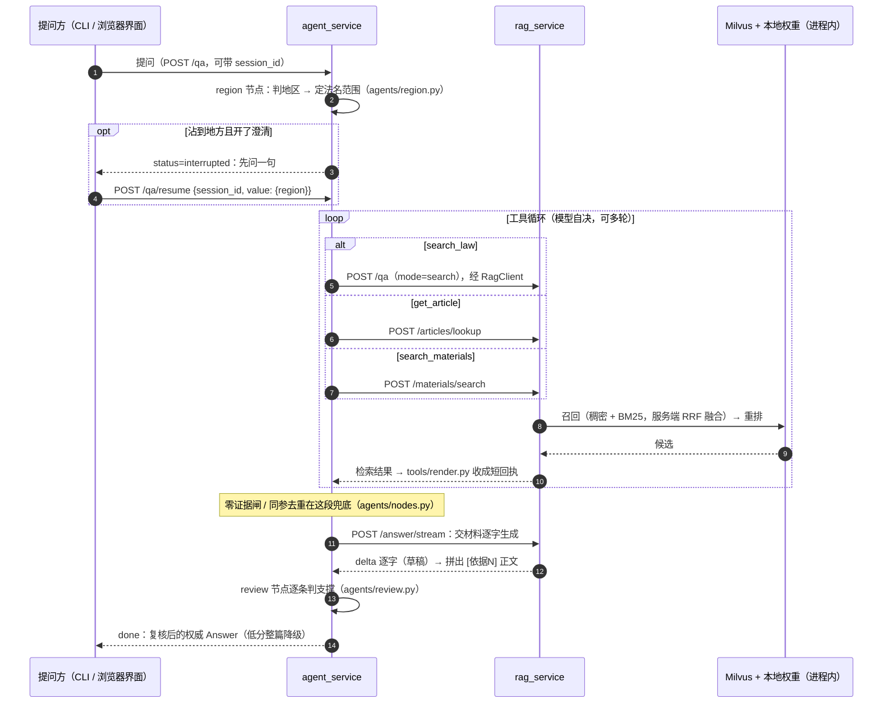
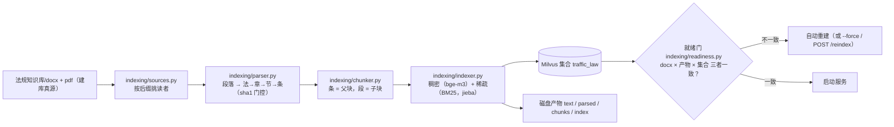

# 项目导读

> 给第一次打开这个仓库的人：一分钟看懂它是什么、由哪些部件组成、一条请求怎么走完全程、想改东西该开哪个文件。
> 三条规则：只写代码里存在的（每个名字都能在仓里搜到）；能挂靠的不复制（命令、契约、运维细节挂回原文）；效果数字只在 [README「效果」](../README.md)。

## 1. 一分钟总览

交通法规问答服务：用大白话提交通法规问题，答案里每条结论挂着 `[依据N]`，能翻回法条原文；库里没有的，它说「没有与问题相关的条文」并指出缺哪类规定，而不是编一条。

代码是**两个进程 + 一个界面**：

- **`rag_service`（知识库侧）**：把法规 docx / pdf 建成索引（Milvus），在线做「口语对齐 → 稠密 + BM25 双路召回 → 重排 → 强制引用式生成」。
- **`agent_service`（Agent 侧）**：不 import rag，只经 `RagClient` 走 HTTP；在 rag 的端点之上跑一个 LangGraph 循环——模型自己决定查什么、查几轮，末端逐条复核引用是否被原文支撑。
- **`frontend/`（浏览器界面，compose 里叫 `web`）**：纯静态页面 + nginx 同源反代，自身没有后端逻辑，全打在 agent 的 HTTP 面上。

另一个进程 `mcp_server` 把同样的能力喂给 MCP 客户端（薄客户端，不载模型）；`eval/` 负责评测题集与「改坏规则必须翻红」的变异自检。**两条问答路径共用同一份检索与生成**，所以线性管道的评测结论对 agent 也成立一半（另一半是循环本身）。

## 2. 关键词

| 词 | 一句话解释 |
|---|---|
| 线性问答 | `python -m rag_service` / `POST /qa?mode=ask` 那条路：一次检索一次生成，不循环 |
| mode=ask / search | rag 一次问答的两档；`search` 只到重排为止、不调大模型（不花钱），评测基线走它 |
| 依据N | 正文里的引用标签，模型写；「编号 → 原文」的对应由 `Answer.render()` 从检索结果拼，不经过模型的手 |
| 复核 / 降级 | 末端 review 节点逐条判每个依据「被原文支撑？」，低分整篇换成降级答复（阈值 `AGENT_REVIEW_MIN_SCORE`） |
| 澄清中断 / resume | 问题沾到具体地区时先中断问一句「按该地法规还是只按全国法」，答复经 `/qa/resume` 交回、从断点续跑（LangGraph interrupt + checkpointer） |
| 父子块 / parent_id | 条 = 父块，段 = 子块；检索命中子块，回执与多轮合并按父块（`merge.py` 按 `parent_id` 去重） |
| 就绪门 | 启动时比对 docx、本地产物、Milvus 集合三者，不一致自动重建（`indexing/readiness.py`） |
| 权重指纹 | 索引快照里记着嵌入权重目录的（文件名 + 大小 + mtime）摘要；换了权重就拒绝服务、要显式放行（启发式） |
| 零证据闸 | 一轮没调任何工具就想收工 → 代码闸再叫一次模型（`agents/nodes.py::_unearned_stop`），不靠提示词自觉 |
| 同参去重 | 与前面某轮参数完全相同的工具调用不执行，回一句「已跳过」 |
| gold / 命中 / hit@k | 评测词汇：gold = 题目的标准答案条；「命中」= gold 落在最终 top-6 里；口径在 README「效果」 |
| S0 快照 | agent 工具回执的切包前 golden；`test_tool_parity.py` 逐字锁着「切包不许改工具输出」 |
| 变异自检 | 把某条规则故意改坏、跑 pytest、**必须翻红**才算这条规则被测到（`eval/mutations/`，四张表） |
| USAGE 常量 | 本仓不写注释也不写 docstring；用法文本放模块级 `USAGE`，`--help` 打印的就是它 |

## 3. 主要部件

| 部件 | 干什么 | 从哪里进 | 细节在哪 |
|---|---|---|---|
| `rag_contracts/` | 两端共用的内核：域类型、7 个端口 ABC、配置、LLM 客户端、埋点。叶子包，import 它不拉重依赖 | `rag_contracts/config.py` | [设计说明书](02_设计说明书.md) |
| `rag_service/` | 知识库侧：建库管线、在线问答、HTTP 面 | `rag_service/container.py`（唯一装配点） | [接口文档](../接口文档.md) §1–§3 |
| `agent_service/` | Agent 侧：图与节点、工具面、会话记忆、自己的 HTTP 面与鉴权/额度 | `agent_service/container.py` → `agents/graph.py` | [接口文档](../接口文档.md) §3.2 |
| `api_contracts/` | 进程间那层：冻结的 `openapi.json` + 薄 httpx 客户端 `RagClient` | `api_contracts/client.py` | [接口文档](../接口文档.md) §1.5 |
| `mcp_server/` | MCP 适配层：stdio → 转 HTTP，工具表不载模型、不 import SDK | `mcp_server/main.py` | [接口文档](../接口文档.md) §2.5 |
| `eval/` | 评测（域内 / 单跳 / 多跳 / 题集桶）+ 变异自检四张表 | `python -m eval` | [功能文档](03_功能文档.md) §5.3 |
| `frontend/` | 浏览器界面（React + Vite）：`src/` 源码、`nginx.conf`、打进 `web` 镜像的 `dist/` | `frontend/src/App.tsx` | 本仓 README「快速开始」 |
| `deploy/` | compose 六服务、build / watchdog / backup 脚本、运维手册 | `deploy/docker-compose.yml` | [运维手册](../deploy/运维手册.md) |
| `tests/` | 离线用例：行为 + 结构门禁（不碰 Milvus、不调模型） | `tests/test_architecture.py` | README「文件结构 → tests/」 |

## 4. 一条真实请求逐步追踪

以提问「在深圳，不按规定使用安全带罚多少？」走 Agent 这条为例（`python -m agent_service "…" --timing`；走服务则是 `POST :8001/qa`）。

对应到代码，编号即上图：

1. **入口**：`agent_service/cli.py`（命令行）或 `agent_service/api/app.py::qa`（HTTP）→ `AgentRunner.ask_payload`（[agents/graph.py](../agent_service/agents/graph.py)）。
2. **判地区**（`agents/region.py`）：识别出「深圳」是地方 → 决定这次检索的法名范围（该地法规 + 全国法）。
3. **澄清**（`agents/clarify.py`，`AGENT_CLARIFY` 开时）：图在此中断，HTTP 回 `status=interrupted`；答复交回 `/qa/resume`，图从断点继续。
4. **主循环**（`agents/nodes.py`）：把问题和工具面交给模型；模型选 `search_law` 后进 `tools` 节点 → `tools/handlers.py` → `RagClient.qa(mode="search")` 打到 rag 服务。
5. **rag 侧**（`rag_service/api/app.py::ask` → `query/dispatch.py` → `query/rewriter.py` → `query/retriever.py`）：口语对齐 → Milvus 双路召回 → RRF → 重排 → 返回。
6. **回执**（`tools/render.py`）：检索结果收成短文本 `ToolMessage`（摘录、去重、只留模型能据此动一下的 note）——模型据此决定收尾还是换词再查；零证据闸与同参去重在这段兜底。
7. **收尾**（`agents/nodes.py` 的 finalize）：模型起草正文，逐字流经 `POST /answer/stream` 推给前端（`delta` 是草稿）。
8. **复核**（`agents/review.py`）：抽正文里的 `[依据N]` 与原文逐条比对，支撑不住的整篇降级。
9. **返回**：`done` 才是权威；终端可用 `--trace` / `--timing` 看决策链与分段耗时（`trace.py`）。

线性那条路（`python -m rag_service "…"`）没有 2、3、8，4–7 收成一次：`dispatch.run(mode=ask)` → `query/generator.py` → `Answer.render()`。

离线建库是另一条独立的流（改语料时才跑）：

## 5. 约定（这个仓的脾气）

- **不写注释、不写 docstring**，全仓刻意为之；用法文本放模块级 `USAGE` 常量。
- **子包 `__init__.py` 一律空文件**，不做 re-export；对外只承诺各包 `__all__` 里写的。
- **配置单源 `rag_contracts/config.py`**；`.env` 只是覆盖层，模板在 `.env.example`。
- **装配只发生在各自的 `container.py`**；别处只接收注入的对象，不许自己 `new` 具体实现——测试里塞内存假件就是靠这条。
- **两个进程之间只有 HTTP**：agent 侧不 import `rag_service`、只拿得到 `RagClient`；rag 侧看不到 agent。AST 门 + 子进程拦截门盯着。
- **错误一律 `QaError`**（一行中文原因）；客户端侧 4xx/5xx 也归成它，材料台账三个透传方法例外。
- **提示词只印模型能据此动一下的东西**；分数、排名、通道、耗时留在 state 的 `search_log`，渲染层决定给不给。
- **规则靠机器盯着**：行为用离线用例，结构用 `tests/test_architecture.py`（AST + 子进程），覆盖用 `eval/mutations/`（改坏必须翻红）。
- **效果数字只在 README「效果」**——这一份和 docs 其余各份都不重复维护数字。

## 6. 改东西去哪找

| 想改什么 | 先开这个文件 |
|---|---|
| 生成侧提示词（每条挂 `[依据N]` 的那套） | `rag_service/prompts.py` |
| 口语对齐（醉驾 → 醉酒驾驶…） | `rag_service/query/rewriter.py` |
| 召回 / 融合 / 重排 | `rag_service/query/retriever.py`（端口定义在 `rag_contracts/ports.py`） |
| 按条号精确取原文 | `rag_service/query/articles.py` |
| agent 主循环 / 零证据闸 | `agent_service/agents/nodes.py` |
| 判地区 / 澄清话术 | `agent_service/agents/region.py` · `agents/clarify.py` · `prompts.py` |
| 末端复核与降级答复 | `agent_service/agents/review.py` · `agent_service/prompts.py` |
| 加一个工具 / 改工具可见性 | `agent_service/tools/registry.py`（一张表：名字 / schema / handler / 可见性），实现放 `tools/handlers.py` |
| 工具回执长什么样 | `agent_service/tools/render.py` |
| 多轮检索结果合并 | `agent_service/merge.py`（按 `parent_id`） |
| rag 的 HTTP 面 | `rag_service/api/app.py`（装配与 runtime 在 `api/runtime.py`） |
| agent 的鉴权 / 额度 / CORS | `agent_service/api/`（`auth.py` · `budget.py`）· `rag_contracts/config.py` 的 CORS 组 |
| 配置与默认值 | `rag_contracts/config.py` + `.env.example` |
| 换模型供应商 | `rag_contracts/llm.py`（全仓唯一直接碰 openai SDK 的地方）+ `.env` |
| 换向量库 / 换本地模型 | `rag_service/adapters/` 三个实现（继承 `ports.py` 的 ABC），装配进 `container.py` |
| 建库管线（解析 / 分块 / 索引） | `rag_service/indexing/`（总装在 `indexing/build.py`） |
| 就绪门与重建判据 | `rag_service/indexing/readiness.py` · `indexing/status.py` |
| 上传入库与台账 | `rag_service/indexing/ingest.py` · `api/routes.py` · `adapters/sqlite.py` |
| 加一部法规 | `法规知识库/` 的 `docx/` 或 `pdf/` 放文件 + 重建；收录口径表在《需求规格说明书》§5 |
| 浏览器界面 | `frontend/src/`（API 封装在 `src/api/`，渲染在 `src/render.ts`） |
| 部署 / 运维 | `deploy/`（`build.sh` · compose · `运维手册.md`） |
| 评测题集与指标 | `eval/`（`harness.py` · `singlehop.py` · `multihop.py` · `corpus.py`） |
| 结构门禁 | `tests/test_architecture.py` · `tests/test_contracts_architecture.py` |
| 契约面（openapi 冻结） | `api_contracts/openapi.json`，重出用 `python -m api_contracts.regen` |
| MCP 工具面 | `mcp_server/tools.py` |

## 7. 怎么跑

- 命令、前置与最短闭环都在 README「快速开始」（安装 / 配置 / 启动 / 测试四段），这里不复制。
- 只想确认环境没坏：`python -m pytest`——全部离线，不碰 Milvus、不调模型。
- 跑起服务后，容器里是六个服务、宿主看 :8001（API）与 :3000（界面）；重建配方与故障排查在 `deploy/运维手册.md`。

## 8. 深入哪里

| 想弄清 | 去读 |
|---|---|
| 需求边界、收录了哪些法规 | [需求规格说明书](01_需求规格说明书.md) |
| 为什么这样分层、门禁清单、取舍记录 | [设计说明书](02_设计说明书.md) |
| 每个能力怎么用、输出什么、边界在哪 | [功能文档](03_功能文档.md) |
| 签名级契约（Python / CLI / HTTP / 配置 / 产物 / 不变式） | [接口文档](../接口文档.md) |
| 效果数据与口径 | [README「效果」](../README.md) |
| 部署 / 巡检 / 告警 / 备份 / 密钥轮换 | [运维手册](../deploy/运维手册.md) |
| 文档全貌与缺口 | [docs 索引](README.md)（索引里 05 测试报告、06 用户手册还没写） |

代码里还有三份「活文档」值得当读物：`tests/test_architecture.py`（结构与文案规则逐条写着）、`eval/mutations/`（每条规则改坏了会怎么红）、各 `container.py`（一处看全装配）。
